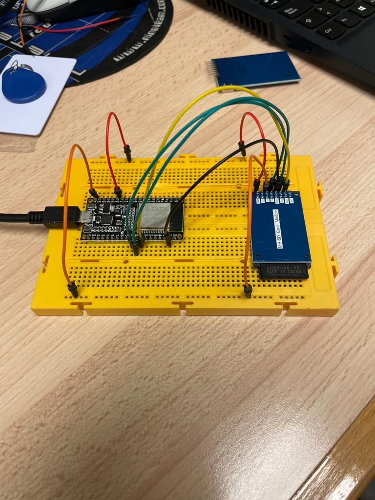
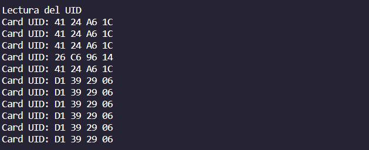
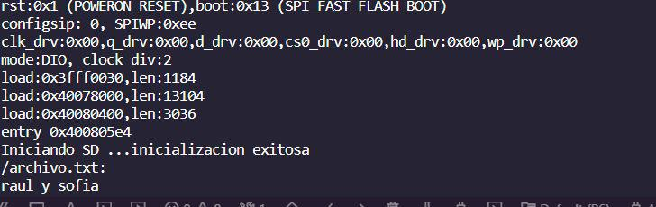

# INFORME PRACTICA 5

## FOTO DEL MONTAJE



## SALIDAS DE DEPURACIÓN






## CODIGO
```cpp
#include <Arduino.h>
#include <Wire.h>

void setup()
{
  Wire.begin();
 
  Serial.begin(115200);
  while (!Serial);             // Leonardo: wait for serial monitor
  Serial.println("\nI2C Scanner");
}
 
 
void loop()
{
  byte error, address;
  int nDevices;
 
  Serial.println("Scanning...");
 
  nDevices = 0;
  for(address = 1; address < 127; address++ )
  {
    // The i2c_scanner uses the return value of
    // the Write.endTransmisstion to see if
    // a device did acknowledge to the address.
    Wire.beginTransmission(address);
    error = Wire.endTransmission();
 
    if (error == 0)
    {
      Serial.print("I2C device found at address 0x");
      if (address<16)
        Serial.print("0");
      Serial.print(address,HEX);
      Serial.println("  !");
 
      nDevices++;
    }
    else if (error==4)
    {
      Serial.print("Unknown error at address 0x");
      if (address<16)
        Serial.print("0");
      Serial.println(address,HEX);
    }    
  }
  if (nDevices == 0)
    Serial.println("No I2C devices found\n");
  else
    Serial.println("done\n");
 
  delay(5000);           // wait 5 seconds for next scan
}

```

## FUNCIONALITAT
En el setup() ponemos las sentencias para la inicialización del programa:

Wire.begin(); inicializa la comunicación I2C.
Serial.begin(115200); inicializa la comunicación serial con una velocidad de 115200. Comunicación entre arduino y serial monitor. 

Serial.println("\nI2C Scanner"); envía una cadena de caracteres "I2C Scanner" seguida de un salto de línea al monitor serial.

El loop será donde escaneamos los dispositivos I2C:

Escanea dispositivos conectados a través del bus I2C en un Arduino. Itera por las direcciones I2C posibles y envía una transmisión a cada dirección. Si no se produce un error en la transmisión, se considera que hay un dispositivo conectado a esa dirección y se muestra un mensaje en el monitor serial. Al final del escaneo, se muestra la cantidad total de dispositivos encontrados. El bucle loop() se repite cada 5 segundos para realizar un nuevo escaneo.